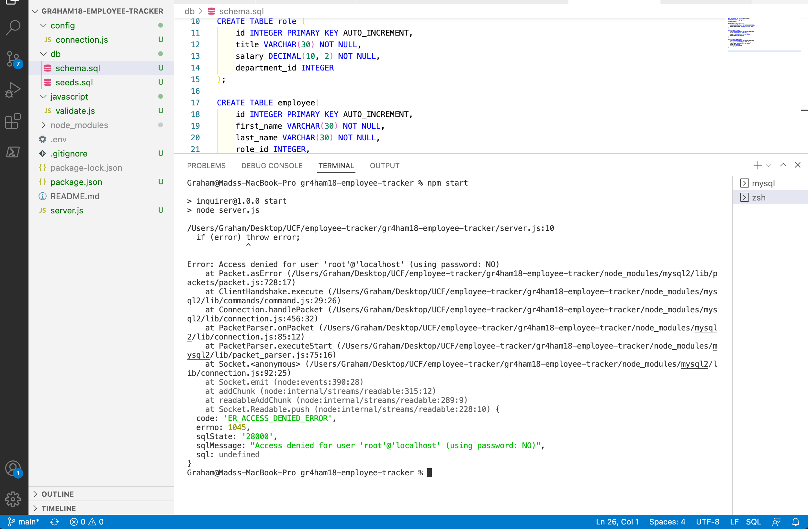

<h1 align="center"> gr4ham18-employee-tracker </h1>
  
 

## Description
 Simple command-line application to manage a company's employee database.

 ## Built With
*Javascript
*NodeJS
*Inquirer
*Console.table
*MySQL

## Table of Contents
- [Description](#description)
- [Installation](#installation)
- [Usage](#usage)
- [License](#license)
- [Contributing](#contributing)
- [Tests](#tests)
- [Questions](#questions)

## Installation
Not required

## Usage
-  Watch the walktrought video here: https://drive.google.com/file/d/1oAIDTUc2dSM2AByUvRzhDquq9-Kt7cfm/view

1. Run "npm i"  to initialize with a package.json and also get inquirer and console.table

2. Run "npm start" to start the application through the command line

3. Answer questions

## License

 
This application is covered by the none license. 

## Contributing
 gr4ham18

## Questions
 reporte issues at my github 
 
Find me on GitHub: [gr4ham18](https://github.com/gr4ham18) 
 
 Email me with any questions: Gr4ham18@gmail.com  

## screenshot 

